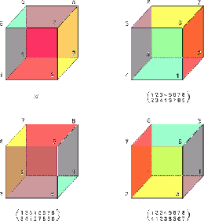
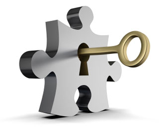
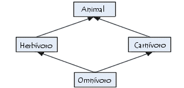
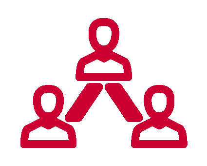

# **Tarea**
### 1. Paradigma.
Un paradigma de programación es un  desarrollo de programas. Es decir, un modelo para resolver problemas computacionales. Los lenguajes de programación, necesariamente, se encuadran en uno o varios paradigmas a la vez a partir del tipo de órdenes que permiten implementar, algo que tiene una relación directa con su sintaxis.
### 2. Abstracción, da dos ejemplos.
La abstracción se define como la características  de un objeto, aquellas que lo distinguen de los demás tipos de objetos y que logran definir respecto a quién está haciendo dicha abstracción del objeto.

En el arte abstracto 

El álgebra abstracta 

### 3. ¿Por qué decimos que la Clase es el mecanismo de abstracción de los lenguajes OO?
Porque las clases contienen datos y métodos los cuales se describen cada uno las características del programa, haciéndolos resaltar sin así que la clase te de todas las características del programa, lo que ella hace es tomar la información de los método o datos
Porque en ella se encuentran datos y métodos los cuales permiten te describen de una manera corta las características. Nos da la descripción de objetos similares
### 4. Explica el concepto de encapsulamiento, busca dos imágenes que te ayuden a describir el concepto, una que tenga algún sistema sin encapsulamiento y otra donde si lo tenga. Menciona por que es importante y que problemas puede evitar.
Organiza y almacena en una clase las características y funcionalidades de los objetos representandolas por medio de atributos y métodos
Existen tres niveles de acceso para el encapsulamiento, los cuales son:

**Público (Public)**: Todos pueden acceder a los datos o métodos de una clase

**Protegido (Protected)**: Podemos decir que estas no son de acceso público, solamente son accesibles dentro de su clase y por subclases.

**Privado (Private)**: En este nivel se puede declarar miembros accesibles sólo para la propia clase.
 
Es importante ya que nos ayuda a que a una clase externa se le permita acceder o no a la información y modifique atributos o acceda a metodos de nuestra clase.

 ### 5. Describe con tus palabras el concepto de herencia e ilustra el concepto con imágenes.
Es determinar de la programación orientada a objetos, donde una rama nueva crece a partir de una rama ya existente. La nueva rama naciente contiene los atributos y métodos de la rama de la cual surge

## UML: diagrama de clases.
### 1. Investiga la historia y haz un resumen del Lenguaje de Modelado Unificado, donde se menciona: quienes son sus principales autores (Booch, Rumbaugh, Jacobson), en que tipo de sistemas se utiliza, en particular el Diagrama de Clases. Menciona algunas de las herramientas para el modelado en UML
El lenguaje UML comenzó a llevarse a cabo en octubre de 1994, cuando Rumbaugh se unió a la compañía Rational fundada por Booch. El objetivo de ambos era unificar dos métodos que habían desarrollado: el método Booch y el OMT . El primer borrador apareció en octubre de 1995,  Jacobson se unió a Rational y se incluyeron ideas suyas. 
UML es ante todo un lenguaje, este lenguaje se centra en la representación gráfica de un sistema. Las objetivos de UML son muchos, pero se pueden sintetizar sus funciones:

**Visualizar**: permite expresar de una forma gráfica un sistema de forma que otro lo puede entender. 

**Especificar**: permite especificar cuáles son las características de un sistema antes de su construcción. 

**Construir**: A partir de los modelos especificados se pueden construir los sistemas diseñados. 

**Documentar**: Los propios elementos gráficos sirven como documentación del sistema desarrollado que pueden servir para su futura revisión. 

UML es un lenguaje de modelado, es una simplificación de la realidad. El *objetivo* del modelado de un sistema es capturar las partes esenciales del sistema. UML ofrece una amplia variedad de diagramas para visualizar el sistema desde varias perspectivas. UML incluye los siguientes *diagramas*:
**Diagrama de casos de uso.** Representa gráficamente los casos de uso que tiene un sistema.
**Diagrama de clases.** Muestra un conjunto de clases, interfaces y sus relaciones. Recoge las clases de objetos y sus asociaciones. En este diagrama se representa la estructura y el comportamiento de cada uno de los objetos del sistema y sus relaciones con los demás objetos, pero no muestra información temporal.
**Diagrama de objetos**. Se muestra la interacción de los objetos que componen un sistema de forma temporal

*Herramientas Para Modelado*
1.  ArgoUML: Permite la exportación a varios formatos gráficos y tiene la disponibilidad de perfiles para varios lenguajes de programación.
2. Día: Día es un programa de creación de diagramas, similar al programa Visio de la suite de ofimática de Microsoft Office.
3.  Frame UML : Permite la generación de código desde el modelo.
4. StarUML: Es una herramienta de fácil uso que ayuda a generar diagramas compatibles con la suite de ofimática de Microsoft Office.

### ¿Sabes de alguna empresa local que utilice este lenguaje? 
*No*
#### 2. Escribe una propuesta de una máquina que venda distintos artículos y haz el diagrama de clases del sistema que propones. Recuerda que puede haber composición (un teclado se compone de botones) y generalización (tipo de productos, tipo de pago).

